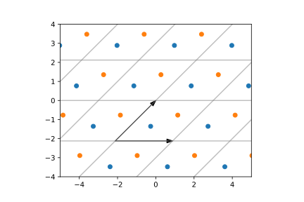
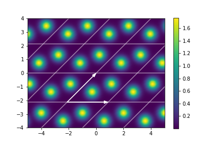
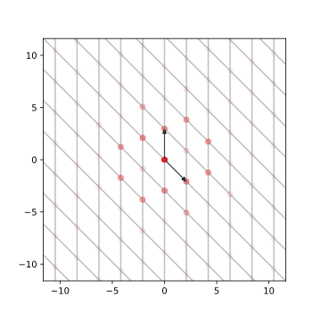
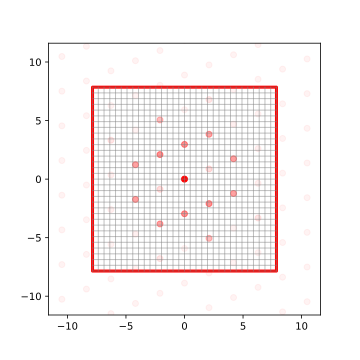
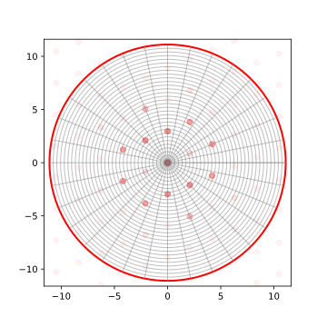
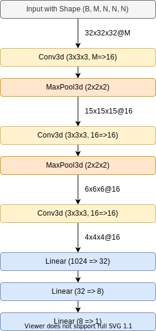

## Voxelization of Crystal Structures
### Predicting Material Properties with Convolutional Neural Networks Based on 3D Representations

This work is based on this [paper](https://www.nature.com/articles/s41598-017-17299-w).

Due to their repeating nature crystal structures can be described by a basis and a set of atom coordinates within the so-called unit cell.
A compound can then be described by a Gaussian field quantity

 
 

The two plots below illustrate this mathematical description.

Now the periodic field quantity can be expanded in a Fourier series over  reciprocal vectors

 
 

The Fourier coefficients can then be descretized to form a descriptor invariant with respect to translation and choice of unit cell and equivariant with respect to orthogonal transformations of the compound in real space.

The implementation of the descriptors can be found in `voxel.py`.
Examples of the methods in use  can be found in `voxel_tutorial.ipynb` and demonstrations of the in-/equivariances in `reciprocal_space_properties.ipynb`.

### Data Sets

The data is collected from the openly available [AFLOW](http://aflowlib.org) database.

### VoxelNet

Utility functions for training a 3D convolutional neural network can be found in `ML_utils.py` and `molloader.py`.
The architecture can be seen below.
 

There are two notebooks where the training results can be found for a smaller and larger dataset: `VoxelNet_all_221_cp5_oxides.ipynb` and `VoxelNet_all_3sp_oxides.ipynb`.
